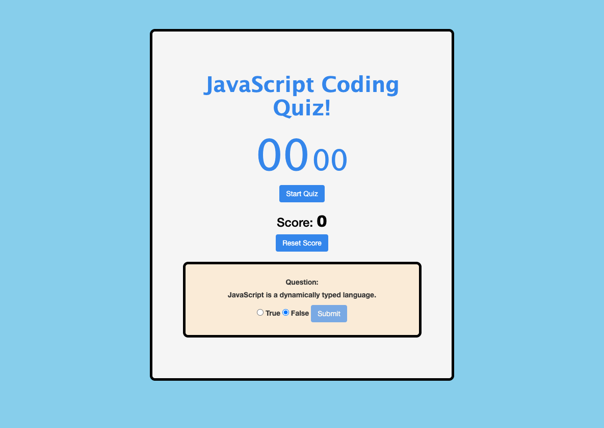
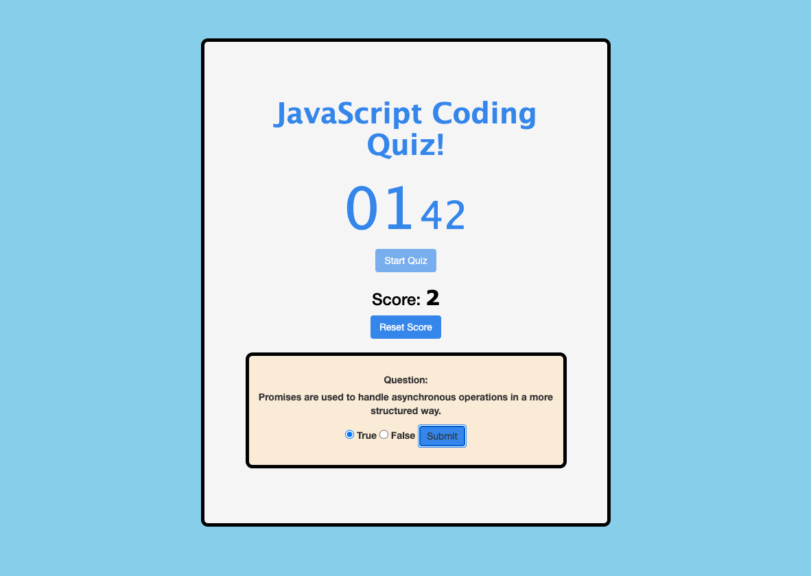
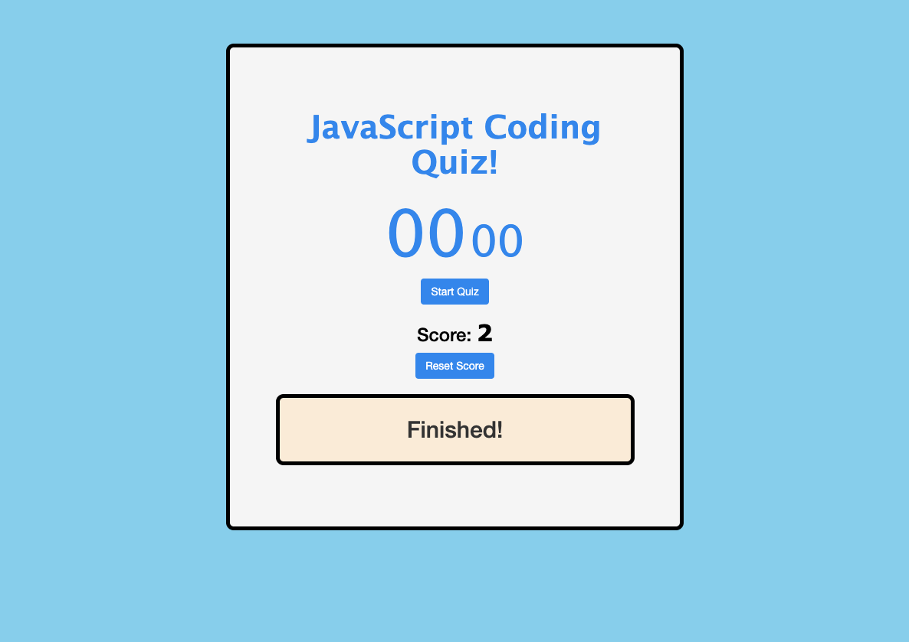

# js_coding_quiz
Coding quiz that provides the user a series of questions about the javascript programming language and tallys their score as they guess questions right. The score is stored persistantly so users can run the quiz numerous times to increase their score over time to compare with collegues and friends.

## Screenshots

Quiz Start:

Quiz Running:

Quiz Finished:
